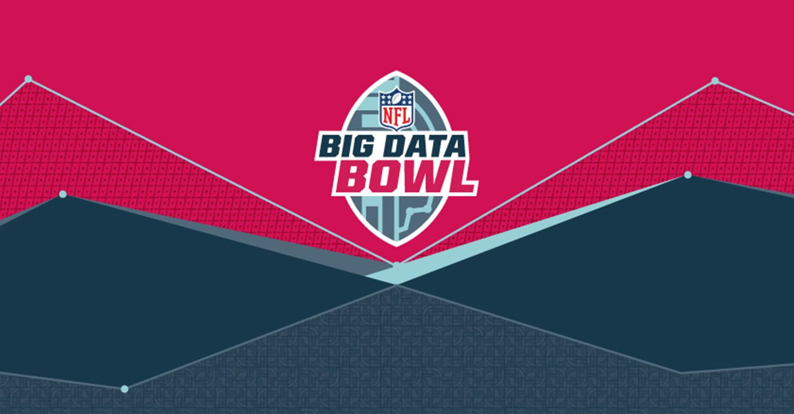

Welcome to the data homepage for the NFL's Big Data Bowl.

For those interested in trying NFL tracking data via [Next Gen Stats](https://nextgenstats.nfl.com/), there is a style guide with references to each data set and each variable, a list of FAQs related to player tracking data and this contest, and a tutorial on how to visualize and animate the player tracking data using the [R Statistical Software](https://cran.r-project.org/), and one game of tracking information.

What remains in this repository
-------------------------------

1.  Player tracking data one 2017 game. See <https://github.com/nfl-football-ops/Big-Data-Bowl/tree/master/Data>. Tracking data is stored as a unique .csv file: `tracking_gameId_[gameId].csv`, where `[gameId]` is a unique, 10-digit identifier for each game.

2.  Player, play, and game-level data that correspond to the tracking data. See <https://github.com/nfl-football-ops/Big-Data-Bowl/tree/master/Data> for each of these .csv files.

3.  A Data schema, which contains information on each of the variables in the data set, as well as the *key* variables needed to link the data sets together. See <https://github.com/nfl-football-ops/Big-Data-Bowl/blob/master/schema.md>.

4.  A list of Data FAQs. See <https://github.com/nfl-football-ops/Big-Data-Bowl/blob/master/faqs.md>.


Official rules
--------------

A complete set of official rules for the Big Data Bowl can be found [here](http://ops.nfl.com/big-data-bowl).

What player tracking data looks like
------------------------------------


### Reading in the data

First, the following code reads in a few of the different data sets and selects a play to animate (Demetrius Harris's TD reception during Week 1, video [here](https://twitter.com/Chiefs/status/905963498169032704).

``` 

```

### Animating the data

The following code animates each player that was on the field. As one note, the code is flexible, such that plays at different parts of the field could feature different boundaries. As a second, the x-axis and y-axis coordinates are flipped.

``` r


## General field boundaries


## Specific boundaries for a given play


## Ensure timing of play matches 10 frames-per-second


```


